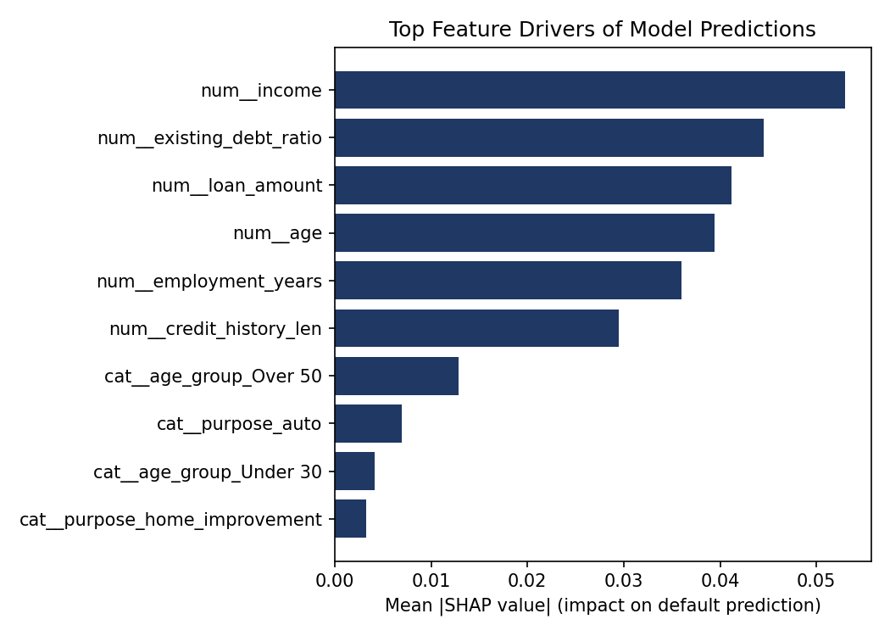

# AI Model Risk & Governance Assessment
### Subject: Synthetic Retail Credit Default Scoring Model
### Framework: NIST AI Risk Management Framework (AI RMF 1.0)
### Assessment Date: September 2026 | Prepared by: Shaik Nishad

---

## 1. Scope & Purpose

This assessment evaluates a machine learning model used to predict borrower
default risk for retail loan applications. The review covers model
performance, population/score drift since baseline validation, subgroup
fairness, and explainability — the core technical checks that support an
AI governance and controls review under frameworks such as NIST AI RMF and
ISO/IEC 42001.

**Model under review:** Random Forest classifier (300 trees, max depth 6),
trained on 6,000 historical loan records to predict probability of default.

**Note on data:** This assessment uses a synthetic dataset constructed to
mimic realistic credit-risk relationships (income, debt ratio, employment
history, credit history length) and a deliberately injected distribution
shift between the baseline and monitoring periods, so that drift, fairness,
and explainability checks would have something genuine to detect. The
findings below are the model's actual computed outputs on that data, not
illustrative placeholders.

---

## 2. GOVERN

*Are there policies and accountability structures for how this model is developed, approved, and monitored?*

| Item | Status | Notes |
|---|---|---|
| Documented model purpose & intended use | ⚠️ Partial | Model purpose is defined here, but no formal model use policy exists (expected for a demonstration project; would be required in production) |
| Human-in-the-loop review before adverse action | ❌ Not implemented | No workflow currently routes high-risk-flagged applicants to human underwriter review |
| Defined model owner / approval authority | ❌ Not implemented | N/A for this project scope — flagged as a gap a real deployment must close |
| Protected-attribute usage policy | ❌ Not implemented | Model currently uses `age_group` as a direct input feature (see Section 4) — this should require explicit governance sign-off or be prohibited under fair-lending policy |

**Recommendation:** Before any production use, establish a model governance policy that (a) prohibits protected attributes as direct model inputs unless legally and formally justified, and (b) requires human review of adverse (loan-denial) decisions above a defined risk threshold.

---

## 3. MAP

*What is the model's context, its inputs, and its known limitations?*

- **Inputs:** age, income, employment years, credit history length, existing debt ratio, loan amount, loan purpose, age group.
- **Output:** probability of default (0–1), used to flag applicants as high-risk.
- **Known limitation identified during mapping:** `age_group` is included as a direct categorical input. Age is a protected characteristic in most lending regulations (e.g., ECOA in the U.S.); using it directly as a model feature — rather than only as a fairness-monitoring attribute — is a design choice that should not pass a real governance review without explicit legal sign-off.

---

## 4. MEASURE

*What do the technical metrics actually show?*

### 4.1 Model Performance (test set, n = 1,500)

| Model | Accuracy | Precision | Recall | F1 | ROC-AUC |
|---|---|---|---|---|---|
| Logistic Regression | 0.674 | 0.118 | 0.588 | 0.197 | 0.676 |
| **Random Forest (production candidate)** | **0.798** | **0.145** | **0.402** | **0.213** | **0.671** |

**Interpretation:** Both models show low precision on the minority "default" class (~7% base rate), which is expected on imbalanced data but means roughly 6 in 7 applicants flagged as high-risk by the Random Forest are actually false positives. Logistic Regression catches more true defaulters (recall 0.59 vs 0.40) at the cost of far more false positives. **This is a business-policy decision, not a modeling one** — the acceptable precision/recall trade-off should be set by risk/credit policy owners, not left to whichever model happens to have the highest accuracy.

### 4.2 Population & Score Drift (PSI)

Computed between the baseline validation period and a simulated later "monitoring" period reflecting a mild economic downturn (lower incomes, higher existing debt):

| Feature | PSI | Flag |
|---|---|---|
| age | 0.004 | 🟢 Stable |
| income | 0.079 | 🟢 Stable |
| employment_years | 0.004 | 🟢 Stable |
| credit_history_len | 0.007 | 🟢 Stable |
| **existing_debt_ratio** | **1.259** | 🔴 **Significant shift — re-validation recommended** |
| loan_amount | 0.005 | 🟢 Stable |
| **Model output score** | 0.080 | 🟢 Stable |

**Interpretation:** `existing_debt_ratio` shows a very large PSI, meaning the population being scored today looks materially different from the population the model was validated on. Because the model's *output score* PSI is still under 0.10, the model's overall risk ranking hasn't shifted much yet — but this is exactly the kind of early warning a model risk function exists to catch before it does show up in the output, and it should trigger a scheduled re-validation rather than being closed as a non-issue.

### 4.3 Subgroup Fairness (by age group)

| Age Group | n | Flagged High-Risk Rate | False Positive Rate | False Negative Rate |
|---|---|---|---|---|
| Under 30 | 1,113 | 51.4% | 47.3% | 14.4% |
| 30–50 | 2,597 | 24.6% | 20.9% | 31.3% |
| Over 50 | 2,290 | 1.2% | 0.5% | 80.7% |

**Max gap in "flagged as high-risk" rate across groups: 50.2 percentage points.**

**Interpretation:** This gap is large enough to warrant investigation on its own, but the SHAP analysis below shows *why* it exists: the model is directly using age group as an input feature (see 4.4), so the disparity is a direct, mechanical consequence of model design — not just an emergent correlation. That distinction matters for remediation: this isn't a case of an innocuous proxy variable that needs monitoring, it's a feature that should likely be removed from the model or replaced with underwriting-relevant variables that don't encode age directly.

### 4.4 Explainability (SHAP)

Top drivers of the model's predictions, by mean absolute SHAP value: **income**, **existing debt ratio**, **loan amount**, **age**, **employment years**, and **age group (Over 50)**.

`age_group_Over 50` appears directly in the top drivers of the model's output — confirming that the fairness gap in Section 4.3 is being driven by the model's explicit use of age, not solely by legitimate credit-risk correlates like income or debt ratio.

---

## 5. MANAGE

*What should happen next?*

| Priority | Finding | Recommended Action |
|---|---|---|
| High | Model directly uses `age_group` as an input feature, producing a 50-point disparity in high-risk flagging across age groups | Remove age/age-derived features from the model; retrain and re-test fairness metrics before any production consideration |
| High | `existing_debt_ratio` shows significant population drift (PSI 1.26) | Schedule a formal re-validation using current-period data; do not treat current model scores as reliable for this feature going forward without review |
| Medium | Low precision (~0.14–0.15) on the flagged high-risk population | Escalate the precision/recall trade-off to a risk policy owner rather than resolving it purely on model accuracy |
| Medium | No human-in-the-loop control for adverse decisions | Implement mandatory human review before any loan denial driven primarily by model output |
| Low | No formal model governance policy on record for this project | Document model purpose, owner, approval, and review cadence per NIST AI RMF "Govern" function |

---

## 6. Maturity Scorecard

Rated on a 1 (ad hoc) to 5 (fully managed) scale against each NIST AI RMF function, based on this assessment's scope:

| Function | Maturity (1–5) | Basis |
|---|---|---|
| Govern | 1 | No documented policy, ownership, or approval process in place |
| Map | 3 | Model context and known limitation (protected attribute usage) identified and documented |
| Measure | 4 | Performance, drift, fairness, and explainability all measured with defined thresholds |
| Manage | 2 | Findings identified; no remediation yet implemented or scheduled |

**Overall maturity: Early / Developing** — technical measurement capability is solid, but governance and remediation processes are not yet in place. This is a typical and expected profile for a model that has been technically validated but not yet run through a full governance lifecycle.

---

*This report and its underlying analysis (`src/risk_assessment.py`, `src/model.py`) are reproducible — all figures above were generated directly from the project's code, not written by hand.*
